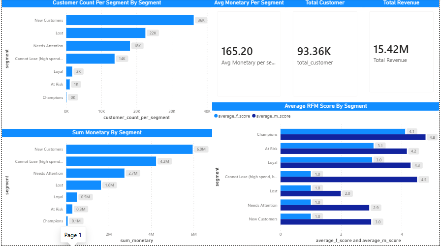

# Customer Retention & Revenue Intelligence

RFM segmentation and clustering of 93K+ Olist e-commerce customers using Python and scikit-learn — with Power BI dashboard revealing $4.23M at-risk revenue and actionable retention insights.

## Key Insights
- Cannot Lose segment: $4.23M revenue but 394 days inactive — highest retention priority
- New Customers: largest segment (36K) contributing $5.95M revenue
- Champions: highest RFM scores (4.1/4.0) but only 122 customers — growth opportunity
- Total Revenue: $15.42M across 93,358 customers

## Tools Used
Python, scikit-learn, pandas, Power BI, DAX

## Dataset
Olist Brazilian E-Commerce Dataset — 93,358 customers, 8 relational tables, 100K+ orders.

Source: [Kaggle — Brazilian E-Commerce Public Dataset by Olist](https://www.kaggle.com/datasets/olistbr/brazilian-ecommerce)
